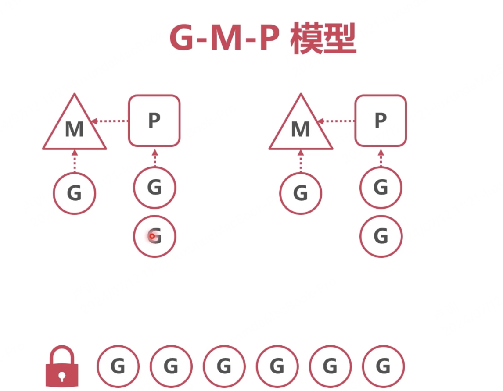
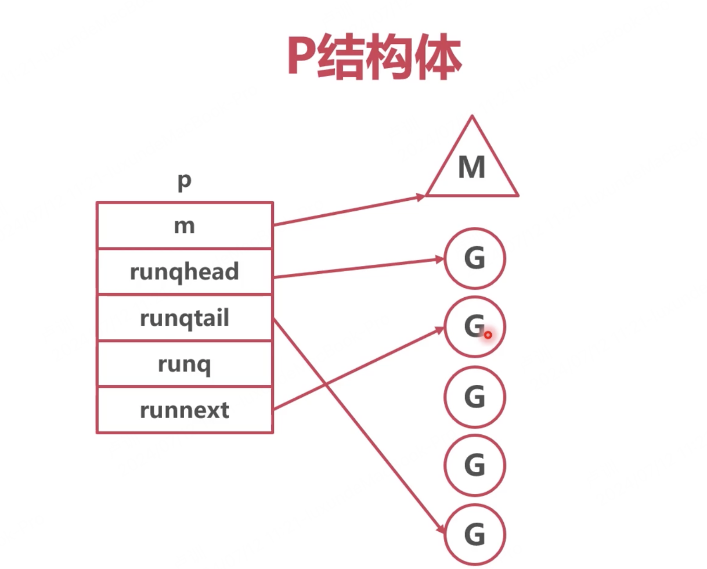

一、为什么要有GMP调度模型？
G:协程 M:线程 P:存储G的队列
最初版本P是一个全局队列，所有的线程都需要从全局队列中获取G，因此多线程处理协程时会抢夺协程队列的全局锁导致效率低下。
如果给每个M线程分配一个存储G的队列呢？这样子就可以解决每次都需要去全局队列中取G的问题，因此GMP模型就诞生了。
GMP模型简单概述:
每个M都有个属于自己的本地队列P, 优先从本地队列P中获取G。本地队列没有则去全局队列中取一批G放到本地队列中，如果本地队列中还没有的话就会去看看其他M的队列P中有无G 有的话可以抢过来调度。

二、GMP模型是如何调度协程的?
对比多线程循环调度，GMP则是将全局协程队列拆分成多个本地队列，而每个本地队列则对应一个M,每个M则对应一个P负责维护这个本地队列，M正常情况下会从本地队列中取协程而不再是从全局队列中去取。而P则是负责从全局队列中拿多个协程到本地队列中供M使用

三、特殊情况时GMP模型是如何处理的？
1、当本地队列中G已经全部被处理完且全局队列中也无G时，那么M怎么办？

P会从其他的本地队列中窃取G到当前的本地队列，从而增加线程的利用率尽量不让M空闲

2、新建协程时GMP会如何处理?

会随机找一个P放入本地队列中并且优先被处理，当所有的本地队列都满时才会放入全局队列中

五、GMP是如何实现协程并发的？
协程饥饿问题:当多个P中本地队列中的一个G调度时需要消耗大量的时间，岂不是本地队列中后续的协程都无法执行了？进而会导致全局的队列中的G都无法被取出处理。
GMP的处理方案:

将需要消耗大量时间的G重新放入P中的本地队列中，从新取出G取处理。而且重新取G时，有一定概率从全局队列中取，进而解决全局队列饥饿问题。

那么什么时候会将G放回队列中重新取G呢？

主动挂起
实际上就是协程中调用runtime.gopark时会将当前G放回P中重新取，runtime.gopark是底层的方法业务中无法调用。例如time.Sleep底层就会使用runtime.gopark方法。

系统指令调用完成时
当程序中调用一些系统底层指令结束后，会调用exitsyscall()方法，而exitsyscall()方法会调用schedule()方法，而之前介绍过schedule()方法就是从协程队列中取出协程并处理。

但是如果协程即不主动挂起系统也没有执行底层指令时怎么办呢？

1、go在编译时会被编译器经常插入执行一个方法:runtime.morestack()，当方法会检测当前协程是否被抢占，而当协程运行超过10ms时则被标记为被强占。如果morestack发现当前协程被标记为被抢占则会直接回到schedule()方法，，进而重新从P中取出G来处理。

2、注册线程信号，当协程中发现需要消耗大量时间时则发送信号执行schedule()方法，重新从P中取出G来处理。