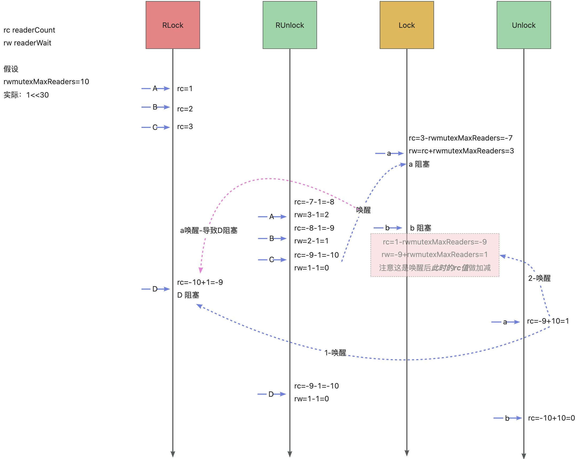

package learn
https://www.cnblogs.com/panlq/p/17373428.html
https://juejin.cn/post/7149782692148543495
1、概述
Lock() 写锁上锁,读锁或写锁存在则阻塞至读锁释放
Unlock() 写锁解锁,写操作完毕后写锁释放
RLock() 读上锁, 写锁存在则阻塞至写锁释放。读锁存在不影响
RUnlock() 读解锁, 读取操作结束后读锁释放

写操作需要等写锁、与读锁
读操作需要等写锁 不需要等读锁

2、源码分析
```
2.1 数据结构
type RWMutex struct {
	w           Mutex        // 互斥锁
	writerSem   uint32       // 写入信号量
	readerSem   uint32       // 读取信号量
	readerCount atomic.Int32 // 读取操作数量
	readerWait  atomic.Int32 // 等待写操作执行完的 读取操作数量
}

// 最大等待读操作数量  1换算成2进制 左移30位 =  2的30次方
const rwmutexMaxReaders = 1 << 30


2.2 写锁上锁
func (rw *RWMutex) Lock() {
	rw.w.Lock() // 互斥锁上锁
	// readerCount赋值为负数 根据readerCount是否为负数来判断 写锁是否被占用
	r := rw.readerCount.Add(-rwmutexMaxReaders) + rwmutexMaxReaders
	
	// r != 0 && rw.readerWait.Add(r) != 0  代表此时有读锁等待
	if r != 0 && rw.readerWait.Add(r) != 0 {
	    // 使用写锁信号量将当前g休眠
		runtime_SemacquireRWMutex(&rw.writerSem, false, 0)
	}
}

2.3 写锁释放
func (rw *RWMutex) Unlock() {
    // readerCount + rwmutexMaxReaders, 回正readerCount 
	r := rw.readerCount.Add(rwmutexMaxReaders)
	if r >= rwmutexMaxReaders {
		race.Enable()
		fatal("sync: Unlock of unlocked RWMutex")
	}
	
	// 根据读信号量唤醒之前因为读锁休眠的 读操作g
	for i := 0; i < int(r); i++ {
		runtime_Semrelease(&rw.readerSem, false, 0)
	}
	// Allow other writers to proceed.
	rw.w.Unlock()
	if race.Enabled {
		race.Enable()
	}
}

2.4 读锁上锁
func (rw *RWMutex) RLock() {
    // readerCount + 1, 结果<0 代表有写锁 则根据readerSem信号量 挂起等待写锁释放
	if rw.readerCount.Add(1) < 0 {
		// A writer is pending, wait for it.
		runtime_SemacquireRWMutexR(&rw.readerSem, false, 0)
	}

}

2.5 读锁释放
func (rw *RWMutex) RUnlock() {
    // readerCount - 1 结果<0  代表依然还有读操作
	if r := rw.readerCount.Add(-1); r < 0 {
		// Outlined slow-path to allow the fast-path to be inlined
		rw.rUnlockSlow(r)
	}
	if race.Enabled {
		race.Enable()
	}
}

func (rw *RWMutex) rUnlockSlow(r int32) {
	// A writer is pending.
	// rw.readerWait.Add(-1) 等待读g数量-1后为0 则代表 没有等待读的g了，可以将等待写的操作唤醒
	if rw.readerWait.Add(-1) == 0 {
		// The last reader unblocks the writer.
		runtime_Semrelease(&rw.writerSem, false, 1)
	}
}
```
上锁解锁流程以及数值变化情况
!

3 Lock()写锁为什么会被RLock()读锁阻塞？
读锁上锁时: rw.readerCount.Add(1)  此时readerCount为1
写锁上锁时: 
rw.readerCount.Add(-rwmutexMaxReaders) 即 1-rwmutexMaxReaders
又 r = 1-rwmutexMaxReaders + rwmutexMaxReaders = 1
故 r != 0 && rw.readerWait.Add(r) != 0 成立 因此 runtime_SemacquireRWMutex(&rw.writerSem, false, 0) 阻塞当前g

4 写操作如何阻塞写操作?
写锁实际上操作的是RWMutex.w互斥锁 对已上锁的互斥锁再次进行Lock()上锁操作时 会走互斥锁的逻辑

5 RLock()读锁为什么会被Lock()写锁阻塞?
写锁上锁时: rw.readerCount.Add(-rwmutexMaxReaders) 即 readerCount被复制为  1-rwmutexMaxReaders 负数
读锁上锁时: rw.readerCount.Add(1) < 0  成立 runtime_SemacquireRWMutexR(&rw.readerSem, false, 0)  当前g进入休眠

