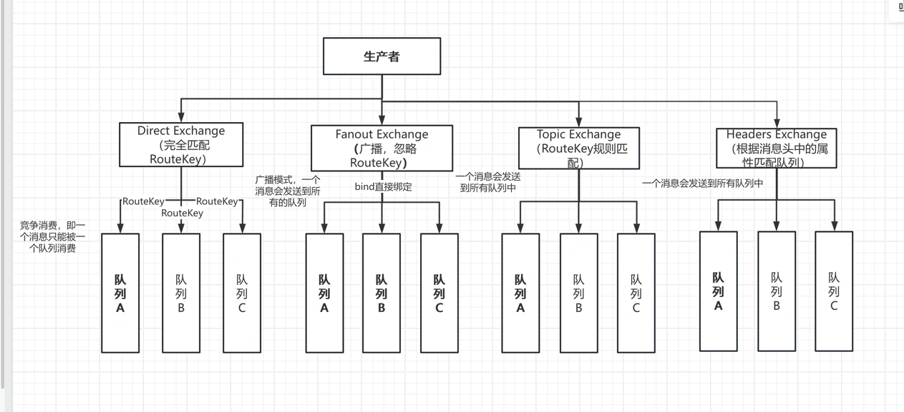

1、交换机、路由KEY、队列

1.1 交换机（Exchange）
RabbitMQ 的消息是先发送到交换机，再根据交换机的路由规则发送到队列，最终存储在队列中。交换机不存储消息接收到生产者的消息后立刻匹配路由规则发送到队列
交换机具体表显形式是以代码数据结构存储在内存中，持久化模式下也会存储在磁盘以便于服务器重启或者崩溃后能恢复到配置状态

Direct Exchange：消息会被路由到与路由键完全匹配的队列中，一个消息只会发送到和RouteKey完全匹配的队列中
Fanout Exchange：消息会被广播到绑定到该交换机的所有队列中，而不考虑路由键。一个消息会发送到所有与交换机建立绑定关系的队列中
Topic Exchange：消息会根据路由键的模式（使用通配符）被路由到一个或多个队列中,
Headers Exchange：消息会根据消息头（Headers）中的属性进行路由，而不是使用路由键. 一个消息会发送到所有匹配到header头规则的队列中

1.2 RouteKey
由1.1可知，是队列与交换机之间的路由规则字符串。创建队列时并不会用到RouteKey。
绑定队列至交换机和发送消息这两个操作才会用到RouteKey。交换机收到消息后会根据消息的RouteKey去匹配与其建立绑定关系的队列的RouteKey，如果规则匹配则会将消息存入队列中。

// 队列绑定至交换机
ch.QueueBind(
    "my_queue",   // 队列名称
    "my_routing_key", // 路由键
    "my_exchange", // 交换机名称
    false,
    nil,
)

// 发送消息至交换机
ch.Publish(
    "my_exchange", // 交换机名称
    "my_routing_key", // 路由键
    false,
    false,
    amqp.Publishing{
        ContentType: "text/plain",
        Body:        []byte("Hello, World!"),
    },
)

1.3 队列

交换机接受到消息后根据消息的路由规则与队列的绑定到交换机的路由规则匹配后发送到队列，队列是存储消息的地方。
// 队列声明
ch.QueueDeclare(
    "my_queue", // 队列名称
    true,       // durable（持久化），当服务器重启时，队列会恢复
    false,      // auto-delete（自动删除），队列在没有绑定的消费者时不会被删除
    false,      // exclusive（排他），队列在连接关闭时会被删除
    nil,        // 参数
)

持久化队列：如果队列被声明为持久化（durable），RabbitMQ 将在服务器重启后重新创建该队列。持久化的队列信息（例如队列名称、属性和绑定信息）会被存储在持久化存储中（通常是磁盘），以便恢复。
非持久化队列：如果队列没有被声明为持久化（durable 属性为 false），则队列不会在服务器重启后自动恢复。这样的队列在服务器重启后会被删除，其相关数据也会丢失。

死信队列

死信队列（Dead Letter Queue, DLQ）是消息队列系统中的一个特性，用于处理无法正常消费的消息。它是一个专门的队列，用来存储那些因为某种原因而不能被消费或处理的消息。这些原因可能包括消息过期、队列满、消息被拒绝等。

死信队列的用途
消息重试：
死信队列可以用来存储那些消费失败的消息，以便进行后续的重试或手动干预。这样可以防止这些消息丢失，并提供了进一步处理的机会。
错误处理：
将无法处理的消息转移到死信队列，有助于集中管理和分析这些失败的消息。这样可以更好地了解错误的根本原因，并改进消息处理逻辑。
消息审计：
死信队列可以作为一个审计机制，记录那些未能成功处理的消息，帮助进行审计和问题追踪。

应该为每个消息队列配置一个死信队列
在 RabbitMQ 中，配置死信队列通常涉及以下步骤：

声明死信队列：
首先，需要声明一个专门用于存储死信消息的队列。这个队列将用于接收从其他队列中转移的死信消息。
go
复制代码
ch.QueueDeclare(
    "dead_letter_queue", // 死信队列名称
    true,                // durable
    false,               // auto-delete
    false,               // exclusive
    nil,                 // arguments
)
配置原始队列的死信交换机：
配置原始队列时，可以指定一个死信交换机和一个死信路由键（x-dead-letter-exchange 和 x-dead-letter-routing-key）。当消息在原始队列中不能被处理时，它们会被转发到这个死信交换机。

ch.QueueDeclare(
    "original_queue",    // 原始队列名称
    true,                // durable
    false,               // auto-delete
    false,               // exclusive
    amqp.Table{  // 在普通消息队列上声明 死信队列的交换机和路由规则,在消息符合条件时会放入死信队列
        "x-dead-letter-exchange": "dead_letter_exchange",
        "x-dead-letter-routing-key": "dead_letter_routing_key",
    },
)
声明死信交换机：
需要声明一个交换机，用于将消息路由到死信队列。这个交换机会处理那些无法正常消费的消息。

ch.ExchangeDeclare(
    "dead_letter_exchange", // 死信交换机名称
    "direct",               // 交换机类型
    true,                   // durable
    false,                  // auto-delete
    nil,                    // arguments
)
绑定死信队列到死信交换机：
最后，将死信队列绑定到死信交换机上，以确保死信交换机能够将消息正确地路由到死信队列。

ch.QueueBind(
    "dead_letter_queue",      // 死信队列名称
    "dead_letter_routing_key", // 死信路由键
    "dead_letter_exchange",   // 死信交换机名称
    false,
    nil,
)
消息变为死信的条件
消息会被转移到死信队列的条件包括：

消息过期：
消息在队列中超过了指定的时间限制而未被消费时，会被转移到死信队列。
队列满：
当队列达到其最大容量限制，且消息无法被添加到队列中时，这些消息会被转移到死信队列。
消息被拒绝：
消息被消费者拒绝（basic.reject 或 basic.nack），并且 requeue 参数设置为 false 时，消息会被转移到死信队列。
消息不可路由：
当消息无法路由到任何绑定的队列（例如在 topic 或 headers 交换机的情况下）时，它们也可能被转移到死信队列。
总结
死信队列是处理消息处理失败或无法正常消费的有用机制，通过将这些消息转发到专门的队列中，可以更好地管理、分析和处理这些失败的消息。配置死信队列涉及声明死信队列、配置原始队列的死信交换机、声明死信交换机和绑定队列等步骤。

tip:实际上在 RabbitMQ 中，交换机、路由键、队列、以及死信队列的声明与绑定都可以由生产者或消费者进行操作
