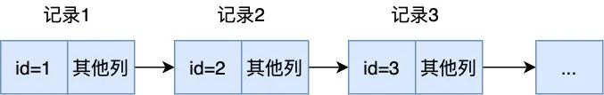
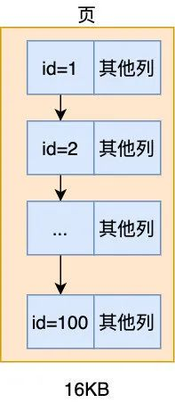
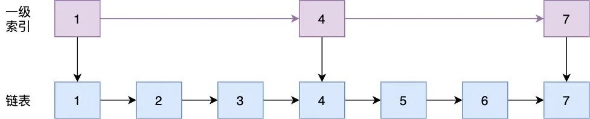
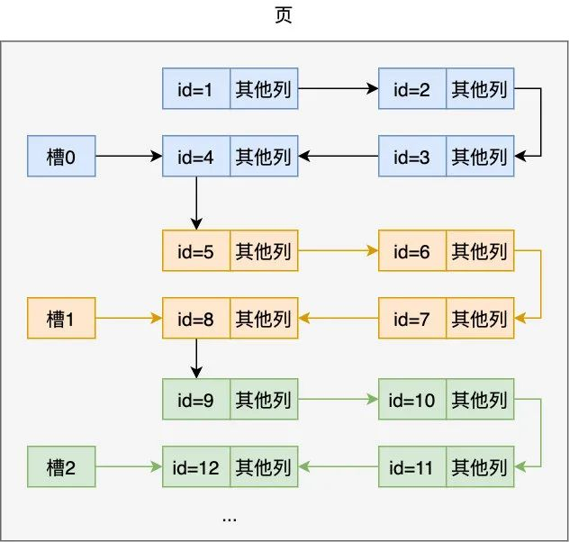
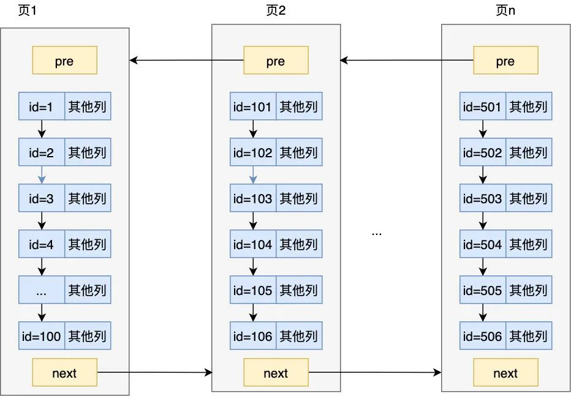
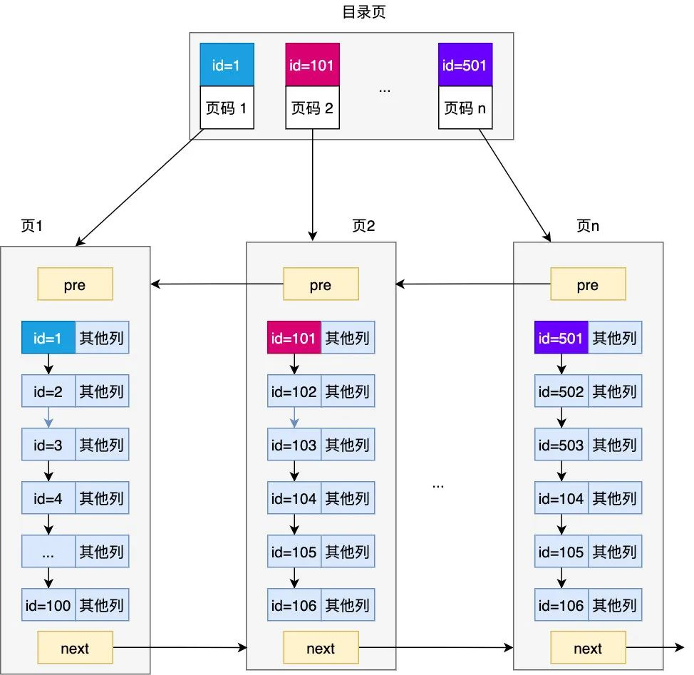
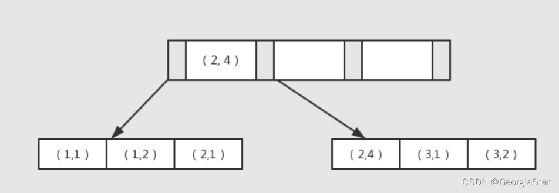
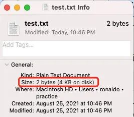
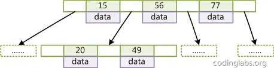

假设有如下数据表及数据
CREATETABLE`user`(
`id`int(11)unsignedNOTNULLAUTO_INCREMENT,
`name`int(11)DEFAULTNULLCOMMENT'姓名',
`age`tinyint(3)unsignedDEFAULTNULLCOMMENT'年龄',
`height`int(11)DEFAULTNULLCOMMENT'身高',
PRIMARYKEY(`id`)
)ENGINE=InnoDBDEFAULTCH

insert into user('name','age','height')values('张三',20,170);
insert into user('name','age','height')values('李四',21,171);
insert into user('name','age','height')values('王五',22,172);
insert into user('name','age','height')values('赵六',23,173);
insert into user('name','age','height')values('钱七',24,174);ARSET=utf8COMMENT='用户表';

如果要查询ID为3的数据:  select * from user where id = 3
那么则需要从ID=1的数据读起，读到第三次时发现是我们要找的数据。每读一次就需要将磁盘里面的数据读到内存即一次IO操作，那么上面SQL则进行了三次ID操作。那如果ID为100岂不是要100次IO？这里就引出 “页”的概念
一次IO优化为一次性从磁盘中读取部分数据，单位为“页”，一页的大小固定为16kb。如果数据行所占内存大则一页的数据量相对会少一些，如果数据行所占内存小则一页的数据量相对则多一些。
如果我们一页的数据刚好也是100行，则数据如下:

虽然一页能读取100条数据，但是现在如果要查ID=100的数据，依然要比较100次。此时可以参考一下调表:

以建立一级索引为例，我们在查找的时候先在一级索引查找，在一级索引里定位到了再到链表里查找，比如我们要找 7 这个数字，如果不用跳表直接在链表里查，需要比较 7 次，而如果用了跳表我们先在一级索引查找，发现只要比较 3 次，减少了四次，所以我们可以利用跳表的思想来减少查询次数。
具体操作如下，每 4 个元素为一组组成一个槽（slot），槽只记录本组元素最大的那条记录以及记录本组有几条记录
 

现在假设我们想要定位 id = 9 的那条记录，该怎么做呢，很简单：首先定位记录在哪个槽，然后遍历此槽中的元素
槽与槽之前是没有数据结构关联的，所以不能直接遍历槽。定位在哪个槽，首先取最小槽和最大槽对应的 id（分别为 4， 12），先通过二分查找取它们的中间值为 (4+12)/2 = 8，8 小于 9，且槽 2 的最大 id 为 12，所以可知 id = 9 的记录在槽2里。所以定位数据在哪个槽是通过类似二分查找的算法来确定的，而不是直接遍历槽。
主要注意的是，槽是页内的数据结构作用是内页数据的"索引"
可以看到通过这种方式在页内很快把我们的元素定位出来了，MySQL 规定每个槽中的元素在 1~8 条，所以只要定位了在哪个槽，剩下的比较就不是什么问题了，当然一个页装的记录终究是有限的，如果页满了，就要要开辟另外的页来装记录了，页与页之间通过链表连接起来，但注意看下图，为啥要用双向链表连接起来呢，别忘了最开头我们列出的 「order by id asc 」和「order by id desc 」这两个查询条件，也就是说记录需要同时支持正序与逆序查找，这就是为什么要使用双向链表的原因

可以看到页与页之前形成双向链表，那么如果有100个页呢？如何定位在哪个页呢？是不是似曾相识？我们参照给页中数据建槽“索引”，我们给页也建一个页"索引不就好了吗"。这里的页索引就是目录页。
这个目录里的每一条记录都对应着页及页中的最小记录，当然这个目录也是以页的形式存在的，为了便于区分 ，我们把针对页生成的目录对应的页称为目录页，而之前存储完整记录的页称为数据页。

这里实际上就是B+树的叶子结点(数据页)与非叶子结点(目录页),目录页可以有多层级,叶子节点为B+树的最后一层。同级叶子结点(数据页)与非叶子结点(目录页)间都是通过前驱后继指针组成了双向链表的数据结构。唯一不同的是 叶子节点中存储了除索引列数据外的其他列的数据(聚簇索引 为全部列数据， 非聚簇索引(辅助索引)为索引列数据)
如果在age列上新建一个索引,则索引为非聚簇索引(辅助索引)。select * from user where age = 20, 虽然会用到age索引,但是因为索引上只存储了age列的数据，因此需要再根据ID获取其他列数据，这就是常说的回表。
为什么设置了命中了索引但还是造成了全表扫描，其中一个原因就是虽然命中了索引但在叶子节点查询到记录后还要大量的回表，导致优化器认为这种情况还不如全表扫描会更快些

联合索引会如何存储?
 
联合索引会将多个联合索引数据一起按顺序存储到B+树节点中，因为索引的存储就是按照最左字段的值顺序存储的，因此联合索引需要遵循最左原则。

磁盘预读
我们知道操作系统是以页为单位来管理内存的，在 Linux 中，一页的大小默认为 4 KB，也就是说无论是从磁盘载入数据到内存还是将内存写回磁盘，操作系统都会以页为单位进行操作，哪怕你只对一个空文件只写入了一个字节，操作系统也会为其分配一个页的大小（ 4 KB）

innoDB 也是以页为单位来存储与读取的，而 innoDB 页的默认大小为 16 KB，那么网上很多人的疑问是这是否意味着它需要执行 4 次 IO 才能把 innoDB 的页读完呢?不是的，只需要一次。
因为这一个页是连续分配的，也即意味着它们的扇区是相邻的，所以它是顺序 IO
操作系统是以页为单位来管理内存的，它可以一次加载整数倍的页，而 innoDB 的页大小为 16KB，刚好是操作系统页（4KB）的 4 倍，所以可以指定在读取的起始地址连续读取 4 个操作系统页，即 16 KB，这就是我们说的磁盘预读，至此相信大家不难明白为啥说读取一页其实只是一次 IO 而不是 4 次了

B-树与B+树的区别

B-树:
B-TREE 每个节点都是一个二元数组: [key, data]，所有节点都可以存储数据。key为索引key,data为除key之外的数据。

检索原理：首先从根节点进行二分查找，如果找到则返回对应节点的data，否则对相应区间的指针指向的节点递归进行查找，直到找到节点或未找到节点返回null指针。
缺点：
1.插入删除新的数据记录会破坏B-Tree的性质，因此在插入删除时，需要对树进行一个分裂、合并、转移等操作以保持B-Tree性质。造成IO操作频繁。
2.区间查找可能需要返回上层节点重复遍历，IO操作繁琐。
3.索引的内存大,增加IO负担

B+树:
从上文可知B+树非叶子节点中只存储索引列数据及主键ID, 叶子节点中存储了除索引列数据外的其他列的数据(聚簇索引 为全部列数据， 非聚簇索引(辅助索引)为索引列数据)。

由此可见,MySQL索引使用B+树的原因主要是因为 B+树索引所占内存更小,遍历起来效率更高。

总结:
1、innodb索引为一棵B+树，B-树中每个节点存储索引数据以及非索引列数据,B+树则只有叶子节点存储索引数据以及非索引列数据。为了减少内存开销，提升IO效率所以MySQL使用B+树的数据结构
2、树中非叶子结点存储索引数据及主键ID信息，叶子节点中存储了除索引列数据外的其他列的数据(聚簇索引 为全部列数据,非聚簇索引(辅助索引)为索引列数据)。
3、同层级页与页之间组成双向链表
4、页中数据为单向链表，为快速定位数据，每隔N个数据建立一个槽指向槽内最大数据，槽与槽之间无关联，是通过类似二分法的算法定位数据在哪个槽内
5、MySQL从磁盘取数据是以页为单位，一页固定位16K。Linux内存读取是4K/次，但因为磁盘的内存是连续的，读取也是顺序IO,一次IO连续读取4个4K大小的单元 因此MySQL读取一页只需要一次IO

