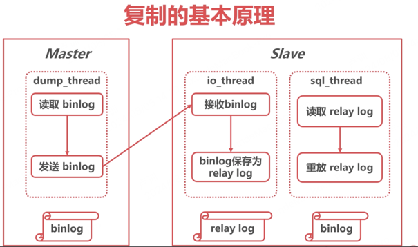
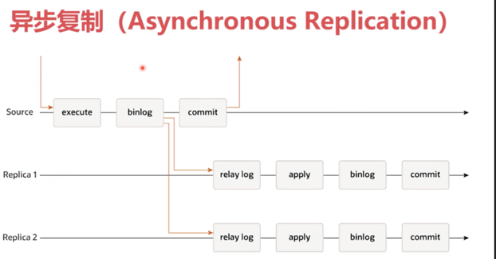
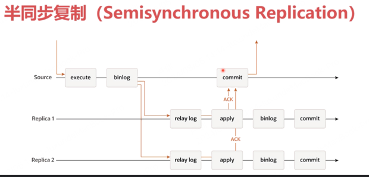
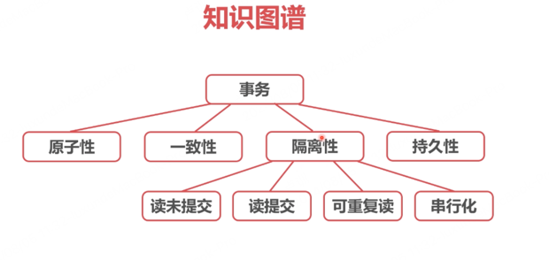
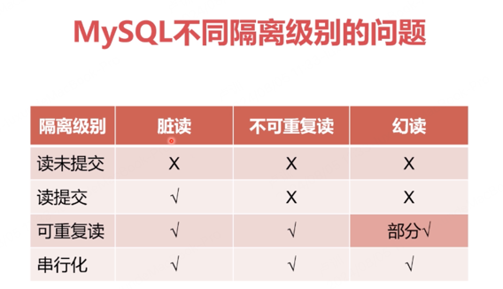
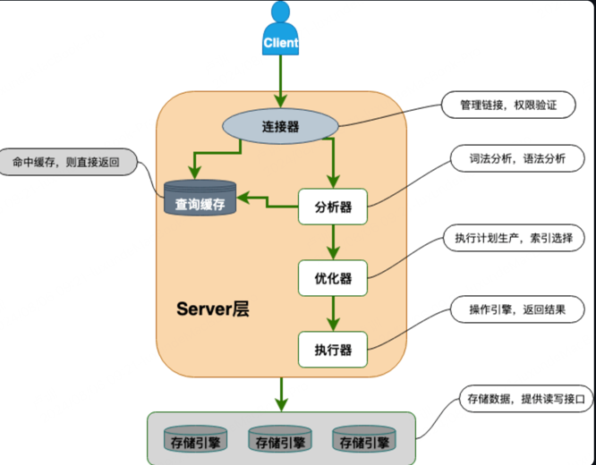

一、MySQL与Innodb有哪些日志
undo log、redo log、 bin log
先后顺序：
第一步：生成 undo log（记录操作前的状态）。
第二步：生成 redo log（记录对数据的物理修改）。
第三步：记录到 binlog（记录逻辑操作）。
作用：
undo log 用于支持事务回滚和 MVCC。
redo log 用于崩溃恢复，确保数据的持久性。
bin  log 用于数据复制和逻辑恢复。

二、undo log
innodb自身产生的逻辑日志，用于事务回滚与旧版本的展示
对任何数据（缓存）的更新都要先写undo log
undo log位于表空间的undo segment中
例子，若SQL执行了update name=b(原name=a) 则 undolog中会记录update name=a 相反能恢复数据的语句

三、bin log
binlog是server层产生的逻辑日志
用来进行数据的复制与传输
binlog完整的记录了数据库每次的数据操作，可以作为数据闪回的手段。同时主从同步，也是依赖的binlog

主从同步主要是依赖binlog文件，主库中将binlog文件同步至备库
备库有io_thread线程将主库的binlog保存为relaylog(中继日志)再由sql_thread线程将relaylog回放执行log中SQL语句完成备份

异步同步

顾名思义，主库执行SQL并不关心binlog是否已经同步给从库。主从之间同步binlog是通过异步的方式同步的，对网络延迟要求小，但是有数据丢失的风险。
主库宕机后因为binlog有可能未及时同步，故从库中数据有可能不是最新的。

半同步复制

从图中可知，半同步复制中主库SQL的执行需要从库的ack。
进一步解释就是主库binlog同步给从库后需要从库保存为relaylog并且ack后主库中binlog才会落盘。

对网络延迟有一定的要求，最好在同一机房
可以保证日志被传送到了备库，不易丢失数据
rpl_time_sync_master_timeout可以调整脱扣时间，避免主库被从库拖垮

四、redo log
innoDB "日志优先于数据"， 记录redo log视为数据已被更新
内存中的数据更新后写redo log，再从redo log中写入磁盘。写入磁盘后redolog删除
redolog存储在四个1Gb的文件中，并且循环写入。
由于 InnoDB 设计了多种机制（WAL、双写缓冲、LSN、原子写操作）来确保日志的完整性和一致性,因此redo log里记录的操作是具有一致性的，即要么全部执行 要么全部不执行
听起来与bin log有点类似，存储的都是SQL的操作日志。不同的是 redo log的作用是系统崩溃时的数据恢复，而bin log用于 数据的复制同步。

五、事务
5.1 事务三大特性
5.1.1 原子性
事务中的操作要么全部执行,要么全部不执行
undo log使用undo log来支持回滚的更改
5.1.2 一致性
事务必须使数据库从一个一致性的状态变换到另一个一致性的状态。如事务中执行操作A-100,B+100 那么结果要么是A-100 B+100 要么是A不变B不变 无论那种结果总和是不变的
undo log使用undo log来支持回滚的更改
5.1.3 隔离性(重点)
事务不能被其他事务的操作数据所干扰
多个并发事务之间要相互隔离
锁和undo log实现了MySQL事务的隔离性
5.1.4 持久性。
一个事务一旦被提交，它对数据库中的数据的改变就是永久性的
redo log实现了MySQL事务的持久性
image.png

5.2 事务的隔离级别
5.2.1 读未提交
读、写都不加锁，不隔离
每次查询都查询到数据的最新版本
性能最好，但是等于没有事务，很少采用
举例:事务1中修改操作会影响到事务2中的读取，即使事务1没有commit。会有脏读问题， 事务与事务间未提交都会有影响 肯定会脏读

5.2.2 读提交
事务1第一次读取A的值为100, 事务2将A改为200 未提交，此时事务1读取A仍然未100，当事务2提交后 事务1读取A则为200
修改数据时S锁，其他事务无法进行修改，提交时释放。可以避免脏读问题，因为事务需要提交后其他事务才能读到 最新的值
但是会有 ”不可重复读问题“，因为事务里最初第一次读取是100， 但是第二次读取的值可能是200  因此是不可重复读

5.2.3 可重复读
事务在开启时 各个值一定固定死，其他事务的修改与提交都不会影响。 因此可以重复读，不会出现事务中第一次与第二次读取的值不一样的情况。
但是可能会幻读,值是固定了 但是行数不固定。如果一个查询第一开始只有一条数据， 后面新插入了一条数据  那么第二次查询就是两条数据
修改数据时，加行锁，提交时释放
MySQL数据库的默认隔离级别
举例:库中原数据A=a，同时开启事务BC，事务B将A改为了b并且已经提交，但事务C读取A依然为a。事务B的修改并不会影响到事务C，事务C读取数据只会读开启事务C时的版本。

5.2.4 串行化
读加S锁、写加X锁提交时释放
对于同一条数据，同时只能有一个事务进行写操作
事务隔离性最高，性能太差，很少采用。
5.3 事务的隔离问题
脏读: 读到了其他事务未提交的数据
不可重复读: 同样的查询读到的数据内容不一样 事务A中 查询一个数据结果是A 过了一会查询结果变为B
幻读:同样的查询读到了更多的数据 事务A中查询一个数据结果有1条 过了一会再查结果变为2条
可重复读这种隔离级别能够解决脏读、不可重复读、幻读(部分解决)的问题。通过next-key锁解决了幻读的问题

六、执行过程
查询语句的执行流程如下：权限校验（如果命中缓存）--->查询缓存--->分析器--->优化器--->权限校验--->执行器--->引擎
更新语句执行流程如下：分析器---->权限校验---->执行器--->引擎---redo log(prepare 状态)--->binlog--->redo log(commit 状态)
