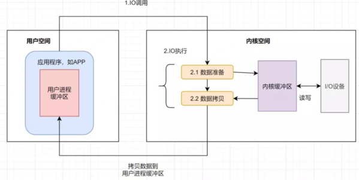
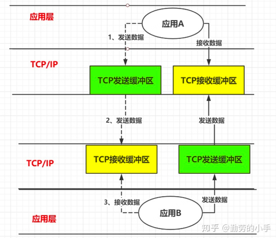
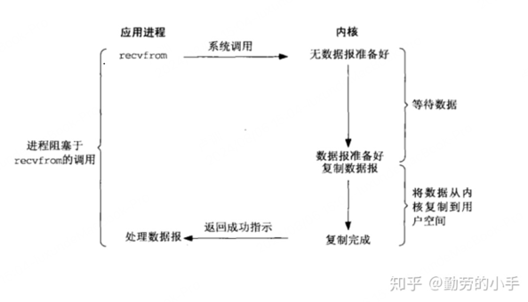
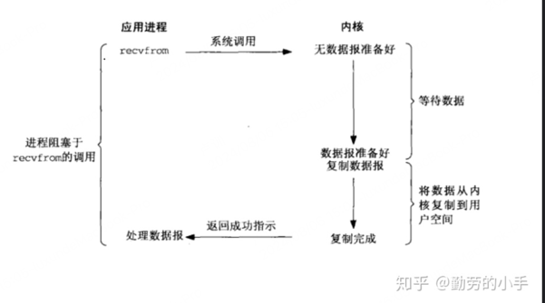
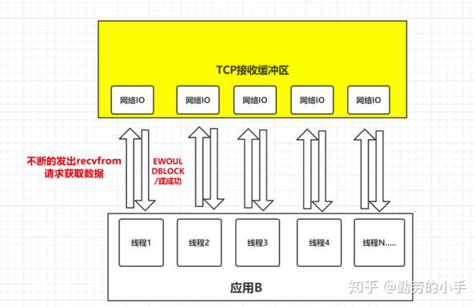
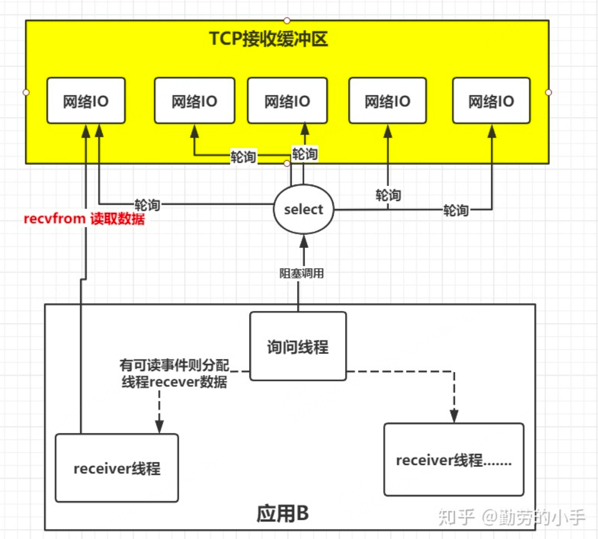

#### 1、什么是I/O?

搜索引擎中大多数文章会这样说:**input/out,用户标准输入输出**。本质上是指:**数据的发送与接收，只要有数据的发送与接收就是一次I/O**。如:键盘输入显示屏这一过程存在系统I/O、一次完整的http请求则存在网络I/O。

#### 2、一次完整的操作系统I/O过程

##### 2.1 什么是用户空间?什么是内核空间?

以32位操作系统为例，它为每一个进程都分配了4G(2的32次方)的内存空间。这4G可访问的内存空间分为二部分，一部分是用户空间，一部分是内核空间。内核空间是操作系统内核访问的区域，是受保护的内存空间，而用户空间是用户应用程序访问的内存区域。

我们应用程序是跑在用户空间的，它不存在实质的IO过程，真正的IO是在操作系统执行的。即应用程序的IO操作分为两种动作：IO调用和IO执行。IO调用是由进程(应用程序的运行态)发起，而IO执行是操作系统内核的工作。此时所说的IO是应用程序对操作系统IO功能的一次触发，即IO调用。

##### 2.2 操作系统一次完整的io经过

1.  应用发起调用请求
2.  应用等待用户缓冲区中数据
3.  内核将数据从内核缓冲区拷贝至用户缓冲区
4.  应用读取用户缓冲区中数据

上述操作中
**:内核将数据从内核缓冲区拷贝至用户缓冲区为 input-数据发送，应用读取用户缓冲区中数据为out-接收。**

#### 3、一次完整的网络I/O过程

数据的发送与接收，不单指应用程序与操作系统之间的数据发送与接收。网络传输中客户端与服务器之间(tcp数据传输)也有数据的接收。

##### 3.1 tcp数据传输中一次完整的io经过

1.  客户端A将数据放入客户端A发送缓冲区
2.  网络传输将A发送缓冲区中数据放入客户端B中的接收缓冲区中
3.  客户端B从客户端B的接收缓冲区中数据读取数据

#### 4、什么是IO模型

1.  阻塞io模型

io模型是一种抽象概念。数据传输时因为tcp传输中缓冲区机制的存在所以会有一种情况，即:当客户端A从接收缓冲区读取数据时若此时接收缓冲区中无数据则需要阻塞，直到读取到数据，这种模式即为阻塞IO模型

1.  非阻塞io模型

顾名思义，客户端A读取数据时当接收缓冲区中数据未准备好时不会等待,而是轮训读取缓冲区中数据,直到读取到数据。

1.  **io复用模型**

阻塞与非阻塞io模型处理tcp连接时都需要单独的一个线程处理,当并发数量多大时非常消耗服务器性能。io复用模型就是为了解决这种问题,大概思路是:把所有的连接套接字集合起来,用一个线程去监听,当某个套接字有事件发生时才起一个线程去处理。这样子就可以节省大量的线程资源,很显然更合理。

不使用io复用模型:

使用io复用模型:

正如上图，IO复用模型的思路就是系统提供了一种函数可以同时监控多个fd的操作，这个函数就是我们常说到的select、poll、epoll函数，有了这个函数后，应用线程通过调用select函数就可以同时监控多个fd，select函数监控的fd中只要有任何一个数据状态准备就绪了，select函数就会返回可读状态，这时询问线程再去通知处理数据的线程，对应线程此时再发起recvfrom请求去读取数据。

**总结：复用IO的基本思路就是通过slect或poll、epoll 来监控多fd ，来达到不必为每个fd创建一个对应的监控线程，从而减少线程资源创建的目的。**
