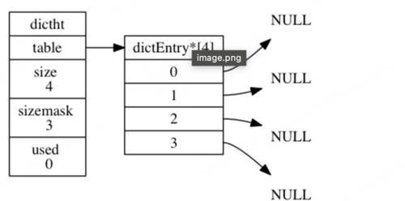

## 一、前言

Redis以高性能著称，不仅其因为采用了单线程，IO多路复用，纯内存读写等等，它还在底层的数据结构实现上用了很大的心思。针对不同的场景采用了不同的数据结构，以提升数据读写效率，降低数据存储空间。
Redis底层六种数据结构:

1.  简单动态字符串
2.  双向链表
3.  压缩列表
4.  哈希表
5.  跳表

## 二、简单动态字符串(SDS)

    struct sdshdr{
      int free;   # 剩余未使用字节长度
      int len;    # 当前字符串长度
      char buf[]; # char类型数组保存字符串的每个字节，并在字符串结尾增加“\0”。    
    }

对于不同大小的字符串，Redis会选用不同类型的结构去存储，因此成为动态字符串
// 定义各种 SDS 头部结构
// 长度小于 32 字节
struct __attribute__ ((__packed__)) sdshdr5 {
    unsigned char flags;  // 低 3 位用于类型标识，高 5 位用于字符串长度
    char buf[];           // 实际的字符串数据
};
 
// 长度小于256字节
struct __attribute__ ((__packed__)) sdshdr8 {
    uint8_t len;          // 已使用的字节数
    uint8_t alloc;        // 分配的字节数（不包括头部和终止符）
    unsigned char flags;  // 低 3 位用于类型标识
    char buf[];           // 实际的字符串数据
};
 
// 长度小于65536字节(64K)
struct __attribute__ ((__packed__)) sdshdr16 {
    uint16_t len;         // 已使用的字节数
    uint16_t alloc;       // 分配的字节数（不包括头部和终止符）
    unsigned char flags;  // 低 3 位用于类型标识
    char buf[];           // 实际的字符串数据
};
 
// 长度小于2^32 字节（约 4.29 亿字节）
struct __attribute__ ((__packed__)) sdshdr32 {
    uint32_t len;         // 已使用的字节数
    uint32_t alloc;       // 分配的字节数（不包括头部和终止符）
    unsigned char flags;  // 低 3 位用于类型标识
    char buf[];           // 实际的字符串数据
};
 
// 适用于长度在 2^32 字节以上的字符串
struct __attribute__ ((__packed__)) sdshdr64 {
    uint64_t len;         // 已使用的字节数
    uint64_t alloc;       // 分配的字节数（不包括头部和终止符）
    unsigned char flags;  // 低 3 位用于类型标识
    char buf[];           // 实际的字符串数据
};
 
 
// String 类型存储数据的最大长度为 512 MB (2^29 字节)
#define SDS_MAX_SIZE (512*1024*1024)  // 512 MB

SDS与普通字符串对比的好处：

*   因为有len属性记录字符串长度，故获取字符串长度时间复杂度为O(1)，而普通字符串长度查询时间复杂度为O(n)。
*   空间预分配。当SDS增加字符串内容时不仅会修改SDS字符串的内存空间，还会预分配一部分空间供字符串修改增加。字符串长度增加时，传统的C字符串需要重新分配内存，而SDS则可以使用free中记录的未分配的内存减少分配内存的次数。
*   惰性空间释放。当SDS字符串减少时，并不会立即释放内存，而是会将内存放入未使用内存中，也是通过free字段来标记供后续使用

## 三、双向链表

链表在 Redis 中的应用非常广泛，比如 List 的底层实现之一链表，当一个 List 包含了数量比较多的元素，又或者列表中包含的元素都是比较长的字符串时，Redis 就会使用链表作为 List 的底层实现。

双向链表中node节点的数据结构如下:

    typedef struct listNode {

        // 前置节点
        struct listNode *prev;

        // 后置节点
        struct listNode *next;

        // 节点的值
        void *value;

    }

双向链表的数据结构如下:

    typedef struct list {

        // 表头节点
        listNode *head;

        // 表尾节点
        listNode *tail;

        // 链表所包含的节点数量
        unsigned long len;

        // 节点值复制函数
        void *(*dup)(void *ptr);

        // 节点值释放函数
        void (*free)(void *ptr);

        // 节点值对比函数
        int (*match)(void *ptr, void *key);

    }

list 结构为链表提供了表头指针 head 、表尾指针 tail ， 以及链表长度计数器 len ， 而 dup 、 free 和 match 成员则是用于实现多态链表所需的类型特定函数：

*   dup 函数用于复制链表节点所保存的值；
*   free 函数用于释放链表节点所保存的值；
*   match 函数则用于对比链表节点所保存的值和另一个输入值是否相等。

## 四、压缩链表

当一个列表键只包含少量列表项， 并且每个列表项要么就是小整数值， 要么就是长度比较短的字符串， 那么 Redis 就会使用压缩列表来做列表键的底层实现。

**压缩列表的构成**: 压缩列表是 Redis 为了节约内存而开发的， 由一系列特殊编码的连续内存块组成的顺序型（sequential）数据结构。一个压缩列表可以包含任意多个节点（entry）， 每个节点可以保存一个字节数组或者一个整数值。

**压缩列表节点的构成**: 每个压缩列表节点都由 previous\_entry\_length 、 encoding 、 content 三个部分组成

*   节点的 previous\_entry\_length 属性以字节为单位， 记录了压缩列表中前一个节点的长度。
*   节点的 encoding 属性记录了节点的 content 属性所保存数据的类型以及长度
*   节点的 content 属性负责保存节点的值 节点值可以是一个字节数组或者整数， 值的类型和长度由节点的 encoding 属性决定

**关于压缩列表的总结**：

*   压缩列表是一种为节约内存而开发的顺序型数据结构。
*   压缩列表被用作列表键和哈希键的底层实现之一。
*   压缩列表可以包含多个节点，每个节点可以保存一个字节数组或者整数值。
*   添加新节点到压缩列表， 或者从压缩列表中删除节点， 可能会引发连锁更新操作， 但这种操作出现的几率并不高。

## 五、哈希表

    typedef struct dictht {

        // 哈希表数组
        dictEntry **table;

        // 哈希表大小
        unsigned long size;

        // 哈希表大小掩码，用于计算索引值
        // 总是等于 size - 1
        unsigned long sizemask;

        // 该哈希表已有节点的数量
        unsigned long used;

    }

*   table 属性是一个数组， 数组中的每个元素都是一个指向 dict.h/dictEntry 结构的指针， 每个 dictEntry 结构保存着一个键值对。
*   size 属性记录了哈希表的大小， 也即是 table 数组的大小， 而 used 属性则记录了哈希表目前已有节点（键值对）的数量。
*   sizemask 属性的值总是等于 size - 1 ， 这个属性和哈希值一起决定一个键应该被放到 table 数组的哪个索引上面。

下图 展示了一个大小为 4 的空哈希表 （没有包含任何键值对）。

哈希节点

    typedef struct dictEntry {

        // 键
        void *key;

        // 值
        union {
            void *val;
            uint64_t u64;
            int64_t s64;
        } v;

        // 指向下个哈希表节点，形成链表
        struct dictEntry *next;

    }

hash冲突时Redis采用的是拉链法解决hash冲突问题。即hash冲突时将冲突的key挂载到已有的哈希节点后形成一个链表。扩容或者收缩的方式与go中map的方式一样都为渐进式。即当进行更新或新增操作时会将原hash桶中元素全部迁移至新桶中。

## 六、跳表

Redis 的跳跃表由 redis.h/zskiplistNode 和 redis.h/zskiplist 两个结构定义， 其中 zskiplistNode 结构用于表示跳跃表节点， 而 zskiplist 结构则用于保存跳跃表节点的相关信息， 比如节点的数量， 以及指向表头节点和表尾节点的指针等等。
